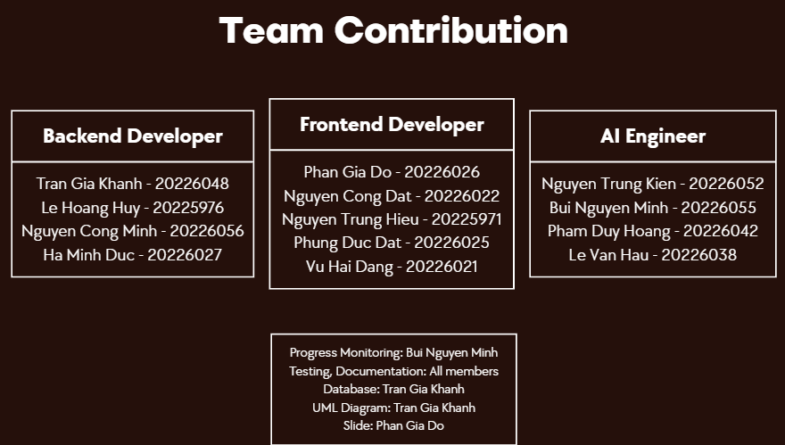

# 🏨 Hotel Booking Management System

[](https://nodejs.org/)
[](https://nextjs.org/)
[](https://python.org/)
[](https://postgresql.org/)

> **Course Project**: Management of Software Development  
> **University**: Hanoi University of Science and Technology (HUST)  
> **Semester**: 20251

A comprehensive hotel booking and management platform with AI-powered features, built as a full-stack application with microservices architecture.

---

## 📋 Table of Contents

- [Project Objectives](#-project-objectives)
- [Team Members & Assigned Roles](#-team-members--assigned-roles)
- [Tech Stack](#-tech-stack)
- [Features](#-features)
- [Installation & Usage Guide](#-installation--usage-guide)
- [API Documentation](#-api-documentation)
- [License](#-license)

---

## 🎯 Project Objectives

| # | Objective | Description |
|---|-----------|-------------|
| 1 | **Unified Platform** | Build a comprehensive hotel booking & management system that serves all stakeholders |
| 2 | **User Experience** | Provide seamless search, booking, and payment flow for customers |
| 3 | **Hotel Management** | Enable efficient room inventory, dynamic pricing, and booking management for hotel managers |
| 4 | **AI Integration** | Implement intelligent features including ML-based recommendations and LLM-powered chatbot |

---

## 👥 Team Members & Contribution

**Group 10**

| # | Name | Student ID | GitHub |
|---|------|------------|--------|
| 1 | Trần Gia Khánh | 20226048 | [khanhtran0611](https://github.com/khanhtran0611) |
| 2 | Phan Gia Đô | 20226026 | [PhanGiaDo20226026](https://github.com/PhanGiaDo20226026) |
| 3 | Nguyễn Công Đạt | 20226022 | [NgCongDat276](https://github.com/NgCongDat276) |
| 4 | Lê Hoàng Huy | 20225976 | [LeHoangHuy20225976](https://github.com/LeHoangHuy20225976) |
| 5 | Lê Văn Hậu | 20226038 | [LeVanHau20226038](https://github.com/LeVanHau20226038) |
| 6 | Nguyễn Trung Hiếu | 20225971 | [hieuhb123](https://github.com/hieuhb123) |
| 7 | Nguyễn Công Minh | 20226056 | [MinhNC20226056](https://github.com/MinhNC20226056) |
| 8 | Bùi Nguyễn Minh | 20226055 | [MinhBuiIcy](https://github.com/MinhBuiIcy) |
| 9 | Phùng Đức Đạt | 20226025 | [ducdat18](https://github.com/ducdat18) |
| 10 | Hà Minh Đức | 20226027 | [HaMinhDuc20226027](https://github.com/HaMinhDuc20226027) |
| 11 | Nguyễn Trung Kiên | 20226052 | [NguyenTrungKien20226052](https://github.com/NguyenTrungKien20226052) |
| 12 | Vũ Hải Đăng | 20226021 | [VuHaiDang-20226021](https://github.com/VuHaiDang-20226021) |
| 13 | Phạm Duy Hoàng | 20226042 | [20226042-PhamDuyHoang](https://github.com/20226042-PhamDuyHoang) |



---

## 🛠 Tech Stack

### Frontend
| Technology | Version | Purpose |
|------------|---------|---------|
| Next.js | 15.x | React framework with App Router |
| React | 19.x | UI library |
| TypeScript | 5.x | Type safety |
| Tailwind CSS | 3.x | Styling |
| Zustand | - | State management |

### Backend
| Technology | Version | Purpose |
|------------|---------|---------|
| Node.js | 18.x | Runtime |
| Express.js | 4.x | Web framework |
| Sequelize | 6.x | ORM |
| PostgreSQL | 15.x | Database |
| MinIO | - | Object storage |
| JWT | - | Authentication |

### AI Services
| Technology | Version | Purpose |
|------------|---------|---------|
| Python | 3.11 | Runtime |
| FastAPI | - | API framework |
| LangChain | - | LLM orchestration |
| Prefect | - | Workflow orchestration |
| RabbitMQ | - | Message queue |

### DevOps
| Technology | Purpose |
|------------|---------|
| Docker | Containerization |
| Docker Compose | Multi-container orchestration |
| Nginx | Reverse proxy |
| GitHub Actions | CI/CD |

---

## ✨ Features

### 🏠 Customer Features
- [x] Hotel search with filters (location, price, stars, amenities)
- [x] Room browsing and availability check
- [x] Booking creation with price calculation
- [x] VNPay payment integration
- [x] Booking history and management
- [x] Hotel and destination reviews
- [x] User profile management
- [x] Notifications center

### 🏨 Hotel Manager Features
- [x] Hotel profile management
- [x] Room type and inventory management
- [x] Dynamic pricing configuration
- [x] Facility management
- [x] Image gallery management
- [x] Booking management (check-in/check-out)
- [x] Review management and responses
- [x] Analytics dashboard

### 👨‍💼 Admin Features
- [x] System dashboard with KPIs
- [x] User management (CRUD, roles)
- [x] Hotel approval/rejection
- [x] Destination management
- [x] Revenue analytics
- [x] System settings

### 🤖 AI Features
- [x] CV processing and parsing
- [x] ML-based recommendations
- [x] LLM-powered chatbot
- [x] RAG (Retrieval-Augmented Generation)
- [x] Workflow orchestration with Prefect

---

## 🚀 Installation & Usage Guide

### Prerequisites

| Requirement | Version |
|-------------|--------|
| Node.js | 18.x or higher |
| Python | 3.11 or higher |
| PostgreSQL | 15.x |
| Docker & Docker Compose | Latest |

### Quick Start (Docker - Recommended)

```bash
# Clone the repository
git clone https://github.com/khanhtran0611/Management-of-software-development-project.git
cd Management-of-software-development-project

# Build and start all services
docker-compose up -d --build

# View logs
docker-compose logs -f

# Stop all services
docker-compose down
```

### Manual Setup

#### 1. Frontend

```bash
cd frontend
npm install
cp .env.example .env.local
npm run dev
```
→ Available at `http://localhost:3000`

#### 2. Backend

```bash
cd backend
npm install
cp .env.example .env
npx sequelize-cli db:migrate
npm run dev
```
→ Available at `http://localhost:4000`

#### 3. AI Services

```bash
cd AI
python -m venv venv
venv\Scripts\activate  # On Linux/Mac: source venv/bin/activate
pip install -r requirements.txt
docker-compose up -d
```

### Access URLs

| Service | URL |
|---------|-----|
| Frontend | http://localhost:3000 |
| Backend API | http://localhost:4000 |
| AI Services | http://localhost:8001-8003 |

---

## 📚 API Documentation

### Backend API Endpoints

#### Authentication
| Method | Endpoint | Description |
|--------|----------|-------------|
| POST | `/auth/login` | User login |
| POST | `/auth/register` | User registration |
| POST | `/auth/logout` | User logout |
| POST | `/auth/refresh-tokens` | Refresh access token |
| POST | `/auth/reset-password` | Reset password |

#### Hotels
| Method | Endpoint | Description |
|--------|----------|-------------|
| GET | `/hotel-profile/all-hotels` | Get all hotels |
| GET | `/hotel-profile/view-hotel/:id` | Get hotel details |
| POST | `/hotel-profile/add-hotel` | Create new hotel |
| PUT | `/hotel-profile/update-hotel/:id` | Update hotel |
| DELETE | `/hotel-profile/delete-hotel/:id` | Delete hotel |

#### Bookings
| Method | Endpoint | Description |
|--------|----------|-------------|
| GET | `/bookings` | Get all bookings |
| GET | `/bookings/:id` | Get booking details |
| POST | `/bookings` | Create booking |
| POST | `/bookings/:id/cancel` | Cancel booking |
| POST | `/bookings/:id/checkin` | Check-in |
| POST | `/bookings/:id/checkout` | Check-out |

#### Payments
| Method | Endpoint | Description |
|--------|----------|-------------|
| POST | `/payments/create` | Create payment |
| GET | `/payments/vnpay-return` | VNPay callback |
| POST | `/payments/:id/refund` | Refund payment |

For complete API documentation, see [Backend README](./backend/README.md).

---

## � License

This project is developed for educational purposes as part of the **Management of Software Development** course at **Hanoi University of Science and Technology (HUST)**.

---

<p align="center">
  Made with ❤️ by <strong>Group 10</strong> - HUST 
</p>
